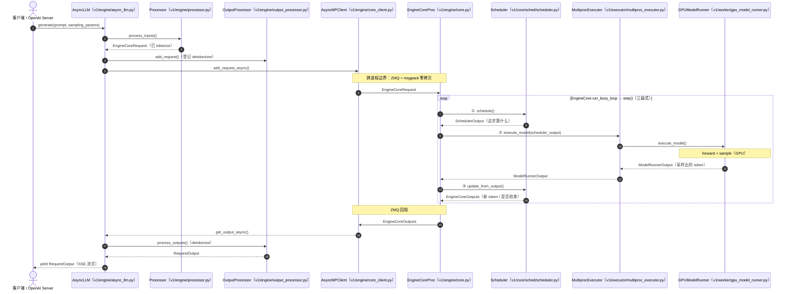
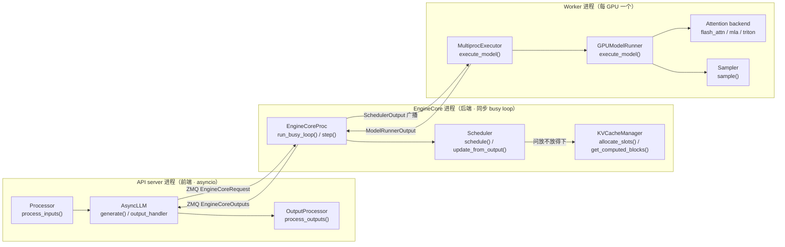

# 可视化链路：请求全流程 + 各模块（含类与方法）

> **这份文档给谁看**：想用**一张图**看清"一个请求怎么流过 vLLM、每一步落到哪个类的哪个方法"的人。灵感来自 vLLM 首届 Meetup（2023-10）的官方 *System Walkthrough*——把请求链路画成框图、每个框标注**类 + 文件 + 方法**；本文沿用这一范式，但更新到当前的 **V1 架构**，并用 **Mermaid 图**（在 GitHub 上会渲染成真正的可视化图；若你看的是纯文本，看代码块里的节点标签即可）。
>
> 配套：业务背景见 [PRIMER](PRIMER.md)，逐行调用链见各模块 `impl.md`，本文是"鸟瞰图"。每个模块的 `impl.md` 顶部也各有一张本模块的 Mermaid 图。

---

## 1. 请求全生命周期（时序图：谁调谁的什么方法）

> 参与者 = **类**（下方标了所在文件）；箭头上的文字 = **被调用的方法**。这就是 Meetup walkthrough 那张"请求链路图"的 V1 版。

> 详解见 [模块 00](00-request-lifecycle/impl.md)。一句话：**前端 tokenize → 跨进程进 EngineCore → schedule/execute/update 三段式 → 跨进程回前端 detokenize → 流式返回。**

---

## 2. 架构总览（组件图：集中控制器 + 分布式 Worker）

> 对应 Meetup walkthrough 的"架构全景"那张图（V1 版）：左边是 EngineCore 进程内的"决策 + 编排"，右边是被下发执行的 Worker。

> 详解见 [模块 03](03-distributed-parallel/design.md)（Executor/Worker）与 [模块 00](00-request-lifecycle/design.md)（进程模型）。

---

## 3. 各模块的可视化链路

每个模块的 `impl.md` 顶部都放了一张**本模块的 Mermaid 调用图**（类 + 方法 + 关键 `file:line`）。下表是快速入口：

| 模块 | 一句话链路 | 图在哪 |
|---|---|---|
| 00 请求生命周期 | 见上方 §1 时序图 | [impl](00-request-lifecycle/impl.md) |
| 01 调度器 | `step()` → `schedule()`（RUNNING/WAITING 两段 + `allocate_slots`）→ `update_from_output()` | [impl](01-scheduler-batching/impl.md) |
| 02 PagedAttention/KV | `get_computed_blocks()` → `allocate_slots()` → `reshape_and_cache`（写）→ paged attention kernel（读，查 block_table） | [impl](02-paged-attention-kvcache/impl.md) |
| 03 分布式并行 | `Executor.execute_model()` → `collective_rpc` 广播 → `Worker` → `GPUModelRunner`（TP 层 all-reduce） | [impl](03-distributed-parallel/impl.md) |
| 04 PD 分离 | prefill 实例 `send_kv` → KVPipe → decode 实例 `recv_kv` → bypass forward | [impl](04-pd-disaggregation/impl.md) |
| 05 投机解码 | proposer `propose()` → target `execute_model()` → `RejectionSampler` → `update_from_output` 回退 | [impl](05-speculative-decoding/impl.md) |
| 06 采样/结构化 | `compute_logits()` → `apply_grammar_bitmask()` → `Sampler.forward()` | [impl](06-sampling-structured-output/impl.md) |
| 07 CUDA Graph/编译 | `capture_model()`（启动期）→ `pad_for_cudagraph()` → graph replay（运行期） | [impl](07-cuda-graph-compile/impl.md) |
| 08 量化 | `get_quant_method()` → `create_weights()` → `process_weights_after_loading()` → `apply()` GEMM | [impl](08-quantization/impl.md) |
| 09 LoRA | `set_active_loras()` → 包装层 → PunicaWrapper SGMV/BGMV | [impl](09-lora/impl.md) |
| 10 多模态 | `process_inputs()` 占位符 → encoder budget 调度 → `_execute_mm_encoder()` → `_gather_mm_embeddings()` | [impl](10-multimodal/impl.md) |
| 11 GPU Kernel | Python 绑定 → C++ launcher → `paged_attention_kernel`（warp/thread_group） | [impl](11-gpu-kernels-memory/impl.md) |
| 12 MoE | router `select_experts()` → `moe_align_block_size()` → grouped GEMM → combine | [impl](12-moe/impl.md) |
| 13 MLA | 投影压缩 → 写 latent → decode 吸收 / prefill 物化 | [impl](13-mla/impl.md) |
| 14 注意力变体 | SWA 释放窗外块 / Cascade 公共前缀一次算 + LSE 合并 / GQA 头映射 | [impl](14-attention-variants/impl.md) |
| 15 Mamba+RoPE | mamba conv+scan 状态读写 / `get_rope()` → `RotaryEmbedding.forward()` | [impl](15-mamba-rope/impl.md) |

> 来源致敬：本可视化范式学习自 vLLM 首届 Meetup（2023-10-05, @a16z SF）的官方 *vLLM System Walkthrough*（Zhuohan Li）。原图为 V0 架构（`LLMEngine` 单进程 + `waiting/running/swapped` 三队列 + `BlockSpaceManager`），本文据当前 V1 代码重绘。
